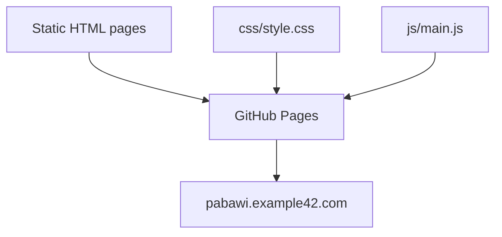

# pabawi.example42.com — Design Document

## Overview

Marketing and documentation website for **Pabawi** — an open-source, self-hosted web interface for classic infrastructure management (Puppet, Bolt, Ansible, SSH, Proxmox, AWS EC2).

This is a **static HTML site** (no build system, no SSG) deployed to GitHub Pages via the `pabawi.example42.com` custom domain.

Live at: [https://pabawi.example42.com](https://pabawi.example42.com)

The Pabawi application itself lives at [github.com/example42/pabawi](https://github.com/example42/pabawi) — this repo is only the marketing/docs site.

## Architecture

Pure static site — three HTML pages, one CSS file, one JS file. No build step, no templating engine, no framework. The `.nojekyll` file disables Jekyll processing on GitHub Pages.

## Components and Interfaces

### Pages

| File | Route | Description |
|---|---|---|
| `index.html` | `/` | Landing page: hero with terminal mockup, integrations strip, features grid (17 cards), use cases (8), target audience personas (7), installation guide, roadmap |
| `docs.html` | `/docs.html` | Full documentation: quick start, prerequisites, Docker deployment, configuration tables, all 8 integration guides, usage sections (inventory, execution, lifecycle, history, journal, RBAC, status dashboard, setup wizards, expert mode), API reference, env vars, troubleshooting |
| `about.html` | `/about.html` | Project philosophy, tech stack, author bio (Alessandro Franceschi), example42 background, license (Apache 2.0), contributing guide |

### Assets

| File | Purpose |
|---|---|
| `css/style.css` | All site styles. Dark theme, gradient accents (indigo → cyan), responsive layout. |
| `js/main.js` | Navigation toggle, scroll animations, copy-to-clipboard for code blocks, docs sidebar active state. |
| `favicon.svg` | SVG favicon (gradient checkmark icon). |

### Configuration

| File | Purpose |
|---|---|
| `_config.yml` | Minimal Jekyll config (title, description, url). Effectively unused since `.nojekyll` disables Jekyll. |
| `CNAME` | Custom domain: `pabawi.example42.com` |
| `.nojekyll` | Disables Jekyll processing on GitHub Pages |

### Navigation

All three pages share the same hardcoded nav bar:
- Home → `index.html`
- Docs → `docs.html`
- About → `about.html`
- GitHub ↗ → `https://github.com/example42/pabawi`
- Get Started (CTA) → GitHub releases page

### Design System

Dark theme with consistent variables:
- Brand gradient: indigo (`#6366f1`) → cyan (`#22d3ee`)
- Background: dark navy/charcoal
- Text: light gray on dark
- Accent colors per integration (orange for Puppet, indigo for Bolt, red for Ansible, cyan for PuppetDB, etc.)
- Typography: Inter (body), JetBrains Mono (code)
- Cards with subtle borders and hover effects
- Terminal mockup component in hero section

### Content Sections (index.html)

1. **Hero** — tagline, description, CTA buttons, stats row, terminal mockup
2. **Integrations strip** — chip badges for all 9 integrations
3. **Features grid** — 17 feature cards (some with version badges)
4. **Use cases** — 8 numbered scenario cards
5. **Target audience** — 7 persona cards with emoji icons and tag badges
6. **Installation** — code blocks + step-by-step guide
7. **Roadmap** — shipped features and upcoming items with status badges

### Documentation Structure (docs.html)

Sidebar navigation with sections:
- Getting Started: Quick Start, Prerequisites, Manual Setup, Docker
- Configuration: Overview, Core Settings, Authentication
- Integrations: Bolt, PuppetDB, Puppetserver, Hiera, Ansible, SSH, Proxmox, AWS EC2
- Using Pabawi: Inventory, Command Execution, VM Lifecycle, History, Node Journal, RBAC, Status Dashboard, Setup Wizards, Expert Mode
- Reference: API Reference, Environment Variables, Troubleshooting

## Dependencies

| Dependency | Purpose |
|---|---|
| Google Fonts | Inter, JetBrains Mono (loaded via CDN) |
| GitHub Pages | Hosting |

No build tools, no npm, no bundler. Everything is hand-written static HTML/CSS/JS.

## Deployment

Push to the default branch. GitHub Pages serves the files directly (Jekyll disabled via `.nojekyll`). Custom domain configured via `CNAME` file.

## Relationship to Pabawi Application

This site documents and markets the Pabawi application. The application itself is a Node.js/Svelte 5 project with:
- Backend: Node.js 20+, Express, TypeScript, SQLite, JWT auth
- Frontend: Svelte 5, TypeScript, Tailwind CSS, Vite
- Integrations: Puppet, Bolt, PuppetDB, Puppetserver, Hiera, Ansible, SSH, Proxmox, AWS EC2
- Deployment: Docker (multi-arch), bare metal
- License: Apache 2.0

The application repo is at `github.com/example42/pabawi`.
